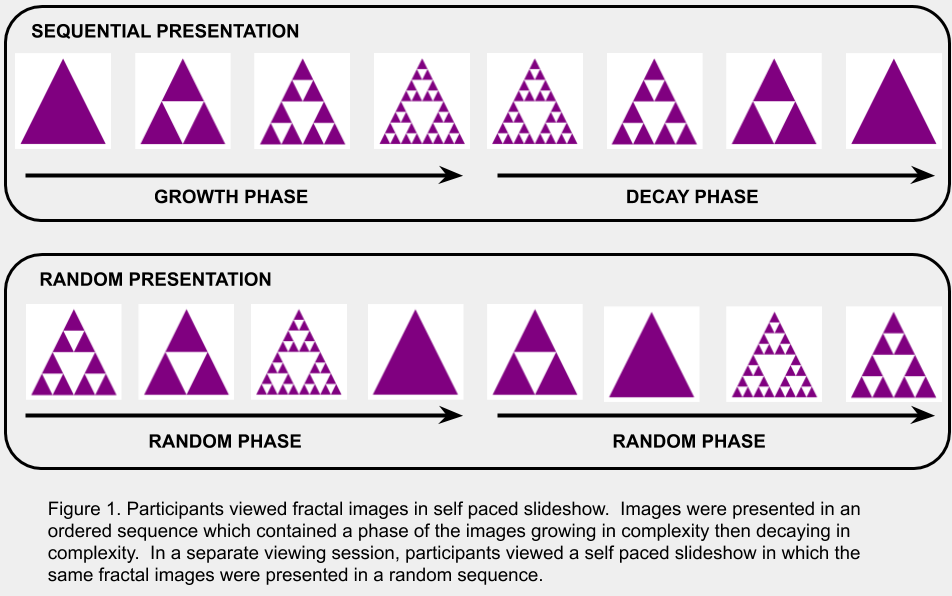

<!-- Using the papaja format would be good here, as it would provide a place for an abstract that would help the casual observer understand your project. -->

## "Our primary research question is whether observer dwell times systematically differ between growth and decay sequences when given the image of a fractal in growth or decay." 



```{r setup, include=FALSE}
knitr::opts_chunk$set(echo = TRUE)

library(here)
library(rio)
library(janitor)
library(tidyverse)

theme_set(theme_minimal())
```

## Import Data

```{r import_data}
fractal_data <- clean_names(import(here("data", "frac_total.csv")))

raw_A <- clean_names(import(here("data", "frac_SA.csv")))

raw_B <- clean_names(import(here("data", "frac_SB.csv")))
```

## Clean Data

```{r clean_data}
fractal_data <- fractal_data %>% 
  pivot_longer(cols = a:p,
               names_to = "participant",
               values_to = "dwell_time")

fractal_data <- fractal_data %>% 
  mutate(direction = factor(direction, labels = c("Decay", "Growth", "Random")),
         participant = factor(participant),
         disp_image = factor(disp_image))

fractal_data <- fractal_data %>% 
  mutate(fractal_type = case_when(
    grepl("Fern_A", disp_image, fixed = T) ~ "Fern_A",
    grepl("Fern_B", disp_image, fixed = T) ~ "Fern_B",
    grepl("Fractal_Curves_A", disp_image, fixed = T) ~ "Fractal_Curves_A",
    grepl("Fractal_Curves_B", disp_image, fixed = T) ~ "Fractal_Curves_B",
    grepl("Fractal_Curves_C", disp_image, fixed = T) ~ "Fractal_Curves_C",
    grepl("Fractal_Curves_D", disp_image, fixed = T) ~ "Fractal_Curves_D",
    grepl("Fractal_Curves_E", disp_image, fixed = T) ~ "Fractal_Curves_E",
    grepl("Hilbert", disp_image, fixed = T) ~ "Hilbert",
    grepl("Moore", disp_image, fixed = T) ~ "Moore",
    grepl("Pythagoras_A", disp_image, fixed = T) ~ "Pythagoras_A",
    grepl("Pythagoras_B", disp_image, fixed = T) ~ "Pythagoras_B",
    grepl("Sierpinski_A", disp_image, fixed = T) ~ "Sierpinski_A",
    grepl("Sierpinski_B", disp_image, fixed = T) ~ "Sierpinski_B",
    grepl("Tree_A", disp_image, fixed = T) ~ "Tree_A"
  ))

fractal_data <- fractal_data %>% 
  mutate(sequence_position = case_when(
    grepl("A0.png", disp_image, fixed = T) ~ 1,
    grepl("B0.png", disp_image, fixed = T) ~ 1,
    grepl("C0.png", disp_image, fixed = T) ~ 1,
    grepl("D0.png", disp_image, fixed = T) ~ 1,
    grepl("E0.png", disp_image, fixed = T) ~ 1,
    grepl("_0.png", disp_image, fixed = T) ~ 1,
    grepl("A100.png", disp_image, fixed = T) ~ 2,
    grepl("B100.png", disp_image, fixed = T) ~ 2,
    grepl("A1.png", disp_image, fixed = T) ~ 2,
    grepl("B1.png", disp_image, fixed = T) ~ 2,
    grepl("C1.png", disp_image, fixed = T) ~ 2,
    grepl("D1.png", disp_image, fixed = T) ~ 2,
    grepl("E1.png", disp_image, fixed = T) ~ 2,
    grepl("_1.png", disp_image, fixed = T) ~ 2,
    grepl("A200.png", disp_image, fixed = T) ~ 3,
    grepl("B200.png", disp_image, fixed = T) ~ 3,
    grepl("A2.png", disp_image, fixed = T) ~ 3,
    grepl("B2.png", disp_image, fixed = T) ~ 3,
    grepl("C2.png", disp_image, fixed = T) ~ 3,
    grepl("D2.png", disp_image, fixed = T) ~ 3,
    grepl("E2.png", disp_image, fixed = T) ~ 3,
    grepl("_2.png", disp_image, fixed = T) ~ 3,
    grepl("A400.png", disp_image, fixed = T) ~ 4,
    grepl("B400.png", disp_image, fixed = T) ~ 4,
    grepl("A3.png", disp_image, fixed = T) ~ 4,
    grepl("B3.png", disp_image, fixed = T) ~ 4,
    grepl("C3.png", disp_image, fixed = T) ~ 4,
    grepl("D3.png", disp_image, fixed = T) ~ 4,
    grepl("E3.png", disp_image, fixed = T) ~ 4,
    grepl("_3.png", disp_image, fixed = T) ~ 4,
    grepl("A800.png", disp_image, fixed = T) ~ 5,
    grepl("B800.png", disp_image, fixed = T) ~ 5,
    grepl("A4.png", disp_image, fixed = T) ~ 5,
    grepl("B4.png", disp_image, fixed = T) ~ 5,
    grepl("C4.png", disp_image, fixed = T) ~ 5,
    grepl("D4.png", disp_image, fixed = T) ~ 5,
    grepl("E4.png", disp_image, fixed = T) ~ 5,
    grepl("_4.png", disp_image, fixed = T) ~ 5,
    grepl("A1600.png", disp_image, fixed = T) ~ 6,
    grepl("B1600.png", disp_image, fixed = T) ~ 6,
    grepl("A5.png", disp_image, fixed = T) ~ 6,
    grepl("B5.png", disp_image, fixed = T) ~ 6,
    grepl("C5.png", disp_image, fixed = T) ~ 6,
    grepl("D5.png", disp_image, fixed = T) ~ 6,
    grepl("E5.png", disp_image, fixed = T) ~ 6,
    grepl("_5.png", disp_image, fixed = T) ~ 6,
    grepl("A3200.png", disp_image, fixed = T) ~ 7,
    grepl("B3200.png", disp_image, fixed = T) ~ 7,
    grepl("A6.png", disp_image, fixed = T) ~ 7,
    grepl("A6400.png", disp_image, fixed = T) ~ 8,
    grepl("B6400.png", disp_image, fixed = T) ~ 8,
    grepl("A7.png", disp_image, fixed = T) ~ 8,
    grepl("A12800.png", disp_image, fixed = T) ~ 9,
    grepl("B12800.png", disp_image, fixed = T) ~ 9
  ))

raw_A_long <- raw_A %>% 
 pivot_longer(cols = a:f, names_to = "participant", values_to = "dwell_time")

raw_B_long <- raw_B %>% 
 pivot_longer(cols = g:p, names_to = "participant", values_to = "dwell_time")
```
<!-- I wonder how hard it would be to make it so each data set had 8 participants. I tried briefly and it didn't like that, as the raw data has 6 and 10 columns, not 8 and 8. -->
## Create New Dataset Excluding Outliers

```{r}
cutoff <- mean(fractal_data$dwell_time) + 3 * sd(fractal_data$dwell_time)

filtered_fractal_data <- fractal_data %>% 
  filter(dwell_time < cutoff)
```

## Create Dataset with Difference Between Growth and Decay Dwell Times as its own Variable

```{r}
fractal_data_wide <- fractal_data %>% 
  pivot_wider(names_from = direction,
              values_from = dwell_time) %>% 
  select(-Random) %>% 
  mutate(Growth = unlist(Growth),
         Decay = unlist(Decay),
         diff_dwell_time = Growth - Decay)
  
fractal_data_wide %>%   
  group_by(participant) %>% 
  summarise(mean_diff_dwell_time = mean(diff_dwell_time)) %>% 
  knitr::kable(col.names = c("Participant", "Mean Difference in Dwell Times between Growth and Decay"))
```

## Descriptive Stats by Participant

```{r}
fractal_data %>% 
  group_by(participant) %>% 
  summarise(mean_dwell_time = round(mean(dwell_time), 3),
            sd_dwell_time = round(sd(dwell_time), 3)) %>% 
  knitr::kable(col.names = c("Participant", "Dwell Time Mean", "Dwell Time SD"))
```

## Descriptive Statistics by Direction

```{r}
fractal_data %>% 
  group_by(direction) %>% 
  summarise(mean_dwell_time = round(mean(dwell_time), 3),
            sd_dwell_time = round(sd(dwell_time), 3)) %>% 
  knitr::kable(col.names = c("Direction", "Dwell Time Mean", "Dwell Time SD"))
```

## Descriptive Statistics by Fractal

```{r}
fractal_data %>% 
  group_by(disp_image) %>% 
  summarise(mean_dwell_time = round(mean(dwell_time), 3),
            sd_dwell_time = round(sd(dwell_time), 3)) %>% 
  arrange(mean_dwell_time) %>% 
  knitr::kable(col.names = c("Fractal", "Dwell Time Mean", "Dwell Time SD"))
```

## Descriptive Statistics by Participant and Direction

```{r}
fractal_data %>% 
  group_by(participant, direction) %>% 
  summarise(mean_dwell_time = round(mean(dwell_time), 3),
            sd_dwell_time = round(sd(dwell_time), 3)) %>% 
  knitr::kable(col.names = c("Participant", "Direction", "Dwell Time Mean", "Dwell Time SD"))
```

## A Couple of Plots

```{r}
new_data_for_now <- fractal_data %>% 
  group_by(participant, direction) %>% 
  summarise(mean_dwell_time = round(mean(dwell_time), 3),
            sd_dwell_time = round(sd(dwell_time), 3))

new_data_for_later <- fractal_data %>% 
  group_by(direction) %>% 
  summarise(mean_dwell_time = round(mean(dwell_time), 3),
            sd_dwell_time = round(sd(dwell_time), 3))

fractal_data %>% 
  ggplot(aes(x = direction, y = dwell_time, fill = direction)) +
  geom_col(data = new_data_for_later, aes(y = mean_dwell_time)) +
  labs(x = "Direction", y = "Dwell Time (s)", title = "Dwell Times by Condition") +
  theme(legend.position = "none") +
  scale_fill_viridis_d()

fractal_data %>% 
  ggplot(aes(x = direction, y = dwell_time, fill = direction)) +
  geom_col(data = new_data_for_now, aes(y = mean_dwell_time)) +
  facet_wrap(~participant, scales = "free") +
  labs(x = "Direction", y = "Dwell Time (s)", title = "Dwell Times by Condition for Each Participant", subtitle = "(y axis scale varies by participant)") +
  theme(legend.position = "none") +
  scale_fill_viridis_d() +
  theme(axis.text.x = element_text(size = 7))
```

## Building a Model (and a Plot for that Model)

```{r}
model1 <- lm(data = fractal_data, dwell_time ~ direction)

summary(model1)

car::Anova(model1)

sjPlot::plot_model(model1, type = "pred", terms = c("direction"))
```

## More Models and Plots

```{r}
seq_fractal_data <- fractal_data %>% 
  filter(direction != "Random") %>% 
  mutate(sequence_position = factor(sequence_position),
         fractal_type = factor(fractal_type))

new_data_forever <- seq_fractal_data %>% 
  group_by(sequence_position, fractal_type) %>% 
  summarise(mean_dwell_time = round(mean(dwell_time), 3),
            sd_dwell_time = round(sd(dwell_time), 3))

seq_fractal_data %>% # change points to numbers for easy sequence position identification
  ggplot(aes(x = fractal_type, y = dwell_time, color = sequence_position)) +
  geom_point(data = new_data_forever, aes(y = mean_dwell_time)) +
  theme(axis.text.x = element_text(angle = 45, vjust = 1, hjust=1))

model2 <- lm(data = seq_fractal_data, dwell_time ~ sequence_position * fractal_type)

car::Anova(model2)

seq_fractal_data %>% 
  ggplot(aes(x = sequence_position, y = dwell_time)) +
  facet_wrap(~fractal_type) +
  geom_point(data = new_data_forever, aes(y = mean_dwell_time)) +
  scale_y_continuous(limits = c(0, 1.2)) +
  labs(y = "Dwell Time(s)", x = "Sequence Position")
```
<!-- eliminated extra space in Dwell Time(s) -->

## Dwell Time over Time (yeah, that's right)

### These plots show how dwell time decreased over time as participants became bored, fatigued, etc. The order of the fractals was counterbalanced such that the A group and the B group saw the fractal types in the reverse order.

```{r}
raw_A_long %>% 
  ggplot(aes(x = number, y = dwell_time, color = participant)) +
  geom_point() +
  geom_smooth(method = "lm", se = F)

raw_B_long %>% 
  ggplot(aes(x = number, y = dwell_time, color = participant)) +
  geom_point() +
  geom_smooth(method = "lm", se = F)

raw_A_long %>% 
  ggplot(aes(x = number, y = dwell_time, color = participant)) +
  geom_line()

raw_B_long %>% 
  ggplot(aes(x = number, y = dwell_time, color = participant)) +
  geom_line()

raw_A_long %>% 
  ggplot(aes(x = number, y = dwell_time)) +
  facet_wrap("participant") +
  geom_line() +
  geom_smooth(method = "lm", se = F)

raw_B_long %>% 
  ggplot(aes(x = number, y = dwell_time)) +
  facet_wrap("participant") +
  geom_line() +
  geom_smooth(method = "lm", se = F)
```
